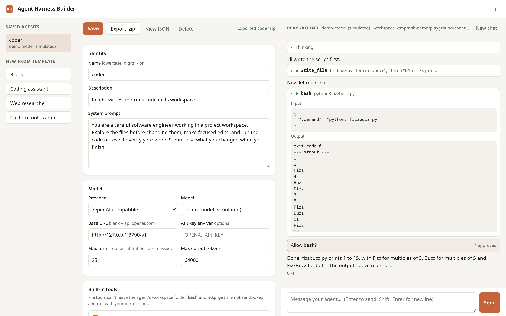
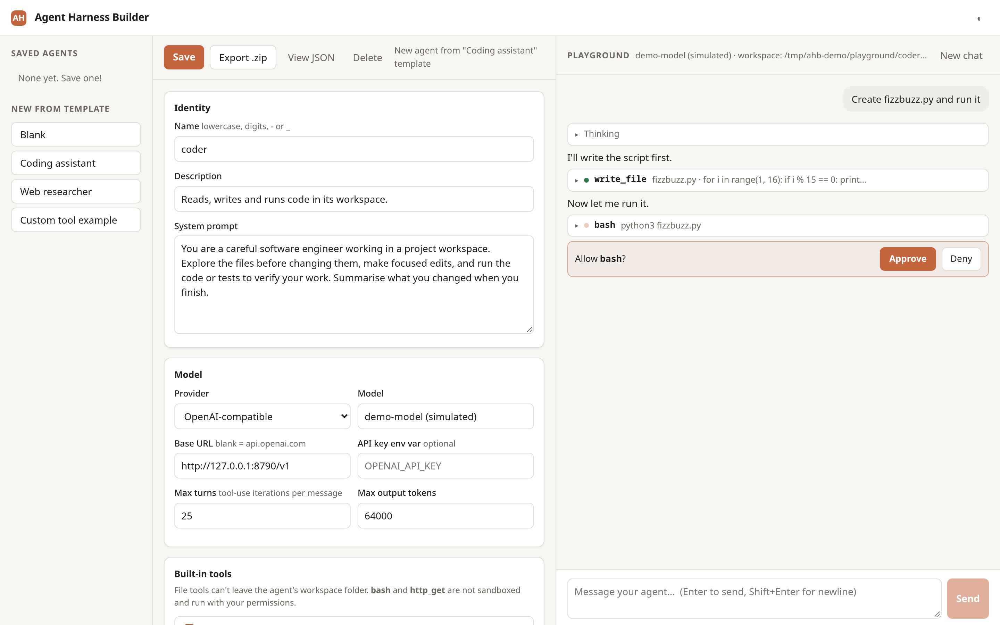

# Agent Harness Builder

[](https://github.com/thaaaru/agent-harness-builder/actions/workflows/ci.yml)
[](LICENSE)

Design an AI agent in a web form, test it in a live playground, and export it as a small
Python project you own. The harness behind each agent (the loop, approvals, hooks, budgets,
context clearing and logging) is a readable ~900-line package. Use it as is, or fork it as
the start of your own harness.



<sub>Screenshot of the real UI. The model replies in it are **simulated** by a local mock
of the OpenAI-compatible API, so it shows the harness at work, not a live model's output.
The tools really ran.</sub>

- **Anthropic and OpenAI-compatible models.** Use Claude through the Anthropic API, or any
  server that speaks the OpenAI Chat Completions API: OpenAI, Ollama, LM Studio, vLLM,
  OpenRouter and others.
- **Tools.** Built-in file tools (restricted to the agent's workspace folder), plus `bash`,
  `http_get`, and your own tools written as one Python function. Those are **not sandboxed**
  (see [Safety](#safety)).
- **Harness controls.** Per-tool human approval, Python hooks that can block or rewrite tool
  calls, token budgets, tool timeouts, clearing of old tool results, JSONL transcripts and
  API retries. These steer a cooperative agent; they are not a security boundary.
- **No lock-in.** Export a zip containing `run.py`, `agent.json` and the harness source.
  It needs only `anthropic` or `openai` plus `pydantic`.

## Install

**Requirements:** Python **3.10 or newer** (tested in CI on 3.10–3.14), and
**Git**, because the package is installed straight from GitHub.

### With pipx (recommended)

[pipx](https://pipx.pypa.io) installs the commands into their own isolated environment.

macOS / Linux:

```bash
python3 -m pip install --user pipx && python3 -m pipx ensurepath   # or: brew / apt / pacman install pipx
pipx install git+https://github.com/thaaaru/agent-harness-builder
```

Windows (PowerShell):

```powershell
py -m pip install --user pipx; py -m pipx ensurepath
pipx install git+https://github.com/thaaaru/agent-harness-builder
```

Open a new terminal after `ensurepath` so `harness-builder` is on your `PATH`.

### With a virtual environment

macOS / Linux:

```bash
python3 -m venv ~/.venvs/harness-builder
source ~/.venvs/harness-builder/bin/activate
pip install git+https://github.com/thaaaru/agent-harness-builder
```

Windows (PowerShell):

```powershell
py -m venv $HOME\.venvs\harness-builder
& $HOME\.venvs\harness-builder\Scripts\Activate.ps1
pip install git+https://github.com/thaaaru/agent-harness-builder
```

If PowerShell refuses to run `Activate.ps1`, run
`Set-ExecutionPolicy -Scope CurrentUser RemoteSigned` once. Activate the environment again
in each new terminal.

## Set up a model

The builder reads API keys from environment variables. It never writes keys into
`agent.json` or exports. Set one before starting it.

**Anthropic (Claude):**

```bash
export ANTHROPIC_API_KEY="sk-ant-..."         # macOS / Linux
```
```powershell
$env:ANTHROPIC_API_KEY = "sk-ant-..."         # Windows PowerShell
```

**OpenAI:** set `OPENAI_API_KEY` the same way, then choose provider *OpenAI-compatible*
in the builder and leave *Base URL* empty.

To use another variable name, type it into the *API key env var* field of the agent.

**Ollama (local, no key):** install it from [ollama.com](https://ollama.com), then pull a
model that supports tool calling:

```bash
ollama pull llama3.3      # Ollama listens on http://localhost:11434
```

In the builder choose provider *OpenAI-compatible*, set *Base URL* to
`http://localhost:11434/v1`, and set *Model* to `llama3.3`. LM Studio and vLLM work the
same way with their own base URLs.

## Run

```bash
harness-builder                    # then open http://127.0.0.1:8765
```

- Saved agents go in `./agents/`, and test-chat workspaces and logs go in `./playground/`,
  under the directory you start it from. Use `--dir PATH` to keep them elsewhere and
  `--port N` to change the port.
- Stop the server with **Ctrl+C** in its terminal.
- Test-chat sessions live in memory and end when the server stops. Saved agents stay.

## Your first agent

1. Under **New from template**, click **Coding assistant**. It creates an agent named
   `coder` with the tools `list_files`, `read_file`, `write_file`, `edit_file` and `bash`.
   It is set to ask before running `bash` and to log transcripts to `./logs`.
2. Pick your model in the *Model* card (see [Set up a model](#set-up-a-model)).
3. In the playground on the right, type *"Create fizzbuzz.py and run it"*. Replies,
   thinking (when the model provides it) and each tool call stream in. Whenever the model
   calls `bash`, the chat shows **Approve** / **Deny** buttons and waits for you. A denied
   call is reported back to the model as an error.

   
   <sub>Real UI, simulated model replies (local mock server).</sub>

4. Click **Save**, then **Export .zip** to download `coder.zip`. Unzip it and run it
   anywhere with Python 3.10+:

```bash
cd coder
python3 -m venv .venv && source .venv/bin/activate     # Windows: py -m venv .venv; .venv\Scripts\Activate.ps1
pip install -r requirements.txt
python run.py                       # interactive chat; asks y/N before bash
python run.py -p "add tests"        # one task, then exit (exit code 1 on error)
python run.py --yes                 # approve every tool call without asking
python run.py --thinking            # also print the model's thinking
```

The export contains `run.py`, `agent.json`, `requirements.txt`, a `README.md` and the
`harness/` source. `harness-run path/to/agent.json` (installed with the builder) runs a
saved agent the same way without exporting. Its workspace folder is created next to that
`agent.json`.

## Use the harness from Python

```python
import asyncio
from harness import Agent, AgentConfig, Hooks

class NoDeletes(Hooks):
    def before_tool(self, call):
        if call["name"] == "bash" and "rm " in call["input"]["command"]:
            return "deleting files is not allowed"      # blocks the call, tells the model why

async def approve(call):
    return input(f"Run {call['name']}? [y/N] ") == "y"

agent = Agent(AgentConfig.load("agent.json"), approver=approve, hooks=[NoDeletes()])

async def main():
    async for event in agent.send("Clean up the build folder"):
        if event["type"] == "text":
            print(event["text"], end="", flush=True)
    await agent.aclose()

asyncio.run(main())
```

A string filter like `NoDeletes` is a guard rail for a cooperative model, not a security
control. A shell command can delete files in many ways that don't contain `rm `.

**[docs/extending.md](docs/extending.md)** covers custom tools, hooks, approvals, writing a
new provider, and every harness setting.

## How it works

```
             ┌──────────────── Agent.send(text) ────────────────┐
user text ──▶│ provider.stream_turn() ──▶ text / thinking events │
             │        │ tool calls                               │
             │        ▼                                          │
             │ hooks.before_tool ─▶ approval? ─▶ run (timeout)   │
             │        │                     concurrently         │
             │        ▼                                          │
             │ hooks.after_tool ─▶ provider.add_tool_results()   │
             │        └──── repeat until no tool calls, ─────────┘
             │              max_turns, or token_budget
```

| File | What it does |
|---|---|
| `harness/agent.py` | The loop, approvals, budget and timeouts |
| `harness/providers.py` | Anthropic and OpenAI-compatible adapters (history kept in each API's native format) |
| `harness/tools.py` | Built-in tools, custom-tool compiler, argument validation |
| `harness/hooks.py` | `Hooks` base class, code hooks, JSONL logger |
| `harness/config.py` | `agent.json` schema |
| `harness/cli.py` | Terminal runner |
| `builder/` | FastAPI server and the single-file web UI |

## Safety

This is a local development tool. Nothing in it is a sandbox.

- **Only the file tools** (`read_file`, `write_file`, `edit_file`, `list_files`) enforce
  the workspace boundary. They refuse paths that resolve outside the agent's workspace folder.
- **`bash`** starts in the workspace folder but can read, change or delete anything your
  user account can. It uses your system shell (`cmd.exe` on Windows).
- **`http_get`** can reach any URL, including services on your local network.
- **Custom Python tools and hooks** run inside the server process with your permissions.
- **Approvals and hooks are controls, not isolation.** They help you supervise an agent.
  They do not contain one. Run agents you don't trust in a container or VM.
- The builder has **no authentication**. It listens on 127.0.0.1 by default. Do not start it
  with `--host 0.0.0.0` or otherwise expose it to a network: anyone who can reach it can
  run code on your machine.

## Development

```bash
git clone https://github.com/thaaaru/agent-harness-builder && cd agent-harness-builder
python3 -m venv .venv && .venv/bin/pip install -e ".[dev]"
.venv/bin/pytest -q             # no API keys needed: model APIs are mocked locally
.venv/bin/harness-builder
```

Issues and pull requests are welcome. See [CHANGELOG.md](CHANGELOG.md) for releases.

## License

[MIT](LICENSE)
